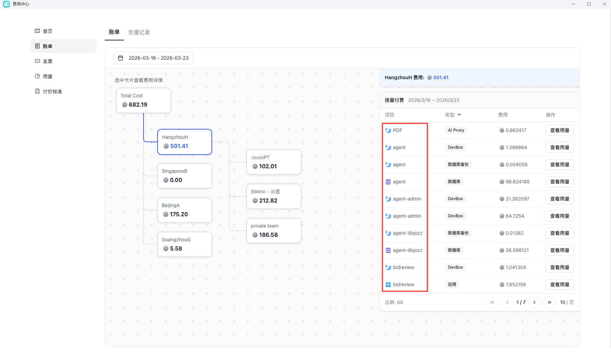
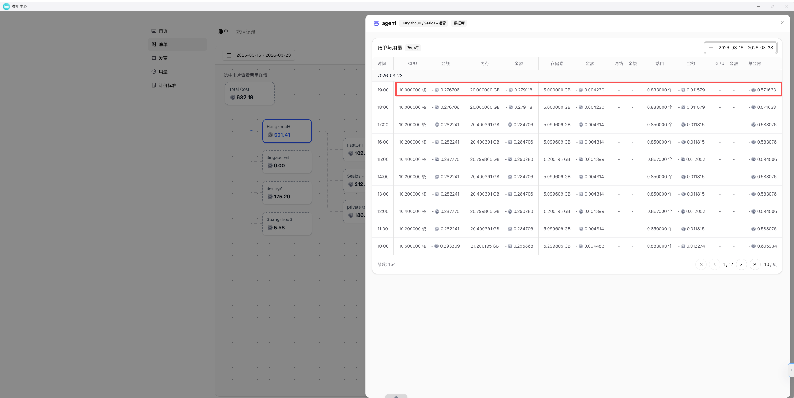

如果你同时管理多个空间，建议优先按工作空间拆开看，而不是只看总消费，通常可以从账单或费用分析界面看到下面这些维度：

- 账户余额与变动记录
- 某个时间范围内的消费金额
- 工作空间维度的成本归属
- 资源类型维度的费用拆分
- 某类服务或某个实例的费用趋势

## 排查消耗应用

如果你已经知道消费异常大致出在哪段时间，再继续下钻到：

- 应用
- 数据库
- DevBox
- 对象存储
- AI Proxy
- 端口或流量

## 排查消耗资源
如果你已经知道确定常大致出在哪段时间哪个应用，再继续下钻到：
- CPU
- 内存
- 存储卷
- 网络
- 端口

## 推荐下一步

- 需要看区域单价口径：继续阅读 [可用区计价标准](/docs/billing/availability-zone-pricing)
- 需要控制上限和成员使用边界：继续阅读 [资源配额](/docs/billing/resource-quotas)
- 需要整理开票资料：继续阅读 [发票明细](/docs/billing/invoice-details)
