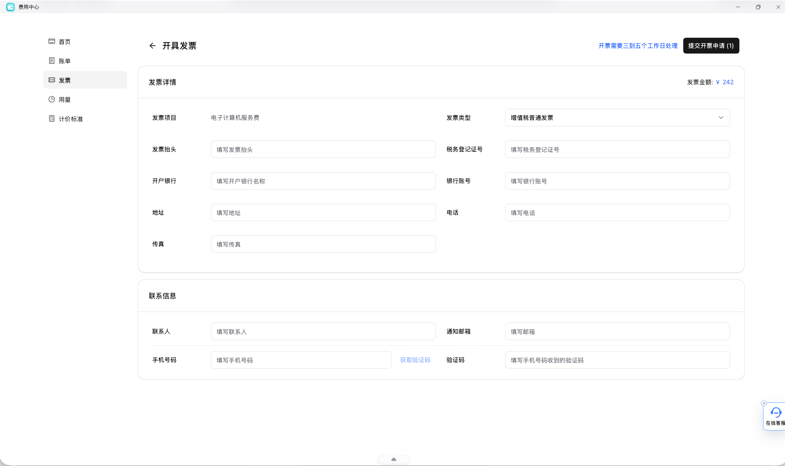

## 开票前先准备什么

建议先准备下面这些信息：

- 开票主体信息
- 纳税人识别号或相关企业信息
- 账单时间范围
- 对应工作空间或业务用途
- 联系方式与收票方式

如果需要提交工单，建议同时附上时间范围、账号信息、工作空间名称和对应账单截图。这样支持方更容易定位。

## 推荐下一步

- 需要先看消费记录：继续阅读 [账单查询](/docs/billing/billing-history)
- 需要准备支付和实名认证：继续阅读 [实名与支付](/docs/billing/real-name-and-payment)
- 需要联系平台支持：继续阅读 [工单与支持](/docs/guides/support-tickets)
