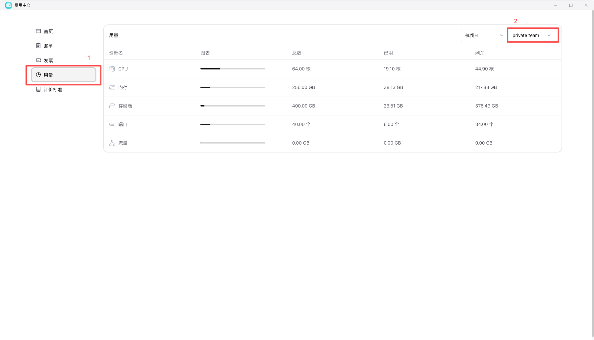

资源配额可以理解为“一个工作空间在当前阶段最多能占用多少资源”的边界控制。它的核心目标不是限制正常使用，而是让团队协作、预算控制和容量管理更可控。

常见的配额维度通常包括：

- CPU
- 内存
- 存储卷
- 可创建资源数量

## 为什么要关注配额

即使账户里还有余额，也不代表每个空间都可以无限创建资源。工作空间通常还会受到独立的资源边界控制。

资源配额的价值主要体现在：

- 防止单个空间意外占满资源
- 给团队预算管理留出明确边界
- 降低误操作导致的大规模成本扩大
- 帮助管理员做环境隔离和容量规划

## 配额和账单的区别

这两个概念很容易混在一起，但它们解决的问题不同：

- 账单回答的是“已经花了多少钱”
- 配额回答的是“最多能用到什么程度”

一个空间可能还没花很多钱，但已经触到资源上限；也可能还有很大配额，但预算上并不希望继续扩容，如果空间配额超出，可在控制台右上角 `工单` 内申请扩容。

## 推荐下一步

- 需要理解费用归属：继续阅读 [账户与计费](/docs/billing/account-and-billing)
- 需要核对实际消费记录：继续阅读 [账单查询](/docs/billing/billing-history)
- 如果资源创建后找不到：继续阅读 [创建过资源，但找不到](/docs/guides/account-workspace/cannot-find-created-resources)
