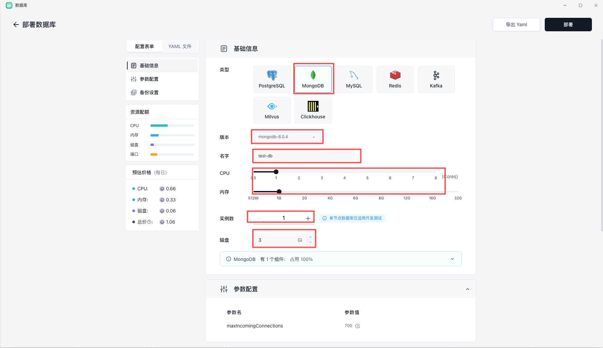
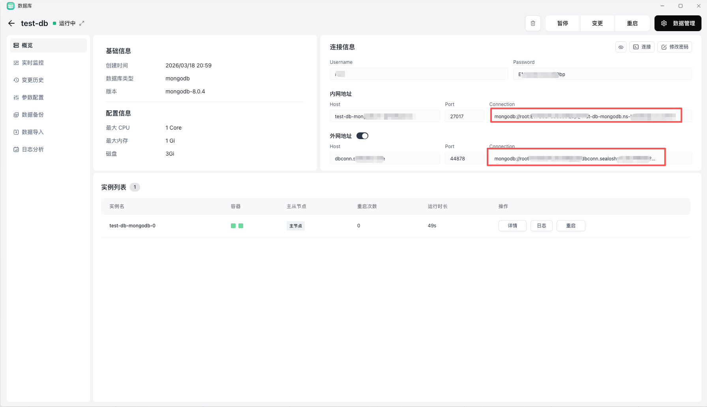

无论你要部署业务数据库、缓存，还是向量库，核心流程都类似：先创建实例，再获取连接信息，最后把它接入应用。

提供多种数据库托管服务，常见包括：

- `MySQL`
- `PostgreSQL`
- `MongoDB`
- `Redis`
- `Kafka`
- `Milvus`

其它请前往 `应用商店` 部署。

## 1. 创建

进入数据库产品页后，按表单逐项确认：

- 名称：便于区分环境，例如 `prod-db`、`staging-pg`
- 版本：优先使用业务已经验证过的版本
- 资源：根据并发、连接数和查询复杂度选择 CPU 与内存
- 磁盘：按当前数据量加上未来增长预留空间
- 参数：没有明确需要时，先保持默认更稳妥
- 备份：建议首次创建时就开启自动备份

## 3. 获取连接方式

实例创建完成后，通常可以在详情页看到连接信息。重点关注这几类入口：

- 内部连接地址：适合同一平台内的应用直接访问
- Web 直连或管理入口：适合快速查看数据和做基础操作
- 外网访问地址：适合本地开发机、第三方服务或 CI 系统接入
- 用户名、密码、数据库名：应用连接时的最小必需信息

如果你的应用本身也部署在 Sealos 里，优先使用平台内网或工作空间内的连接方式，通常更简单，也更安全。

## 常见问题

### 连接不上数据库

优先检查下面四件事：

- 主机地址和端口是否填错
- 用户名、密码、数据库名是否与控制台一致
- 应用是否使用了错误的网络入口
- 数据库是否仍在启动、变更或重启中

### 不确定该不该开公网

如果调用方本身也运行在 Sealos 上，通常没必要先开公网。只有在本地机器、外部服务或第三方平台必须直连时，再考虑开启外部访问。

### 创建后规格不够

先观察监控、连接数和慢查询，再决定是否变更 CPU、内存或磁盘。数据库比普通应用更依赖稳定性，尽量避免频繁、盲目调大。

## 下一步

- [数据库使用指南](/docs/guides/databases)
- [使用 Docker 部署应用](/docs/getting-started/deploy-docker-image)
- [对象存储快速开始](/docs/getting-started/create-object-storage)
- [功能清单](/docs/reference/feature-list)
