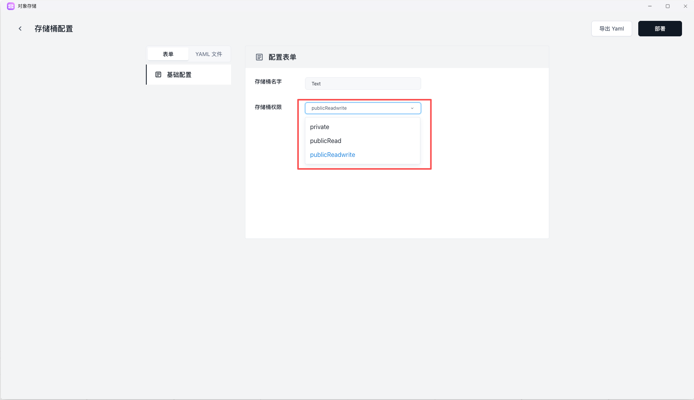

对象存储适合承载用户上传文件、图片、音视频、构建产物、模型文件和其他不适合放进容器本地磁盘的数据。第一次使用时，建议先完成一轮最小闭环：创建桶、上传文件、确认访问方式。

## 1. 创建存储桶

进入对象存储后，首先创建一个桶（Bucket）。通常需要确认：

- 存储桶名称：建议按项目和环境命名，例如 `myapp-prod-assets`
- 访问权限：先按最小权限原则设置
- 所属工作空间：避免把测试和生产资源混在一起



如果只是验证上传和下载流程，建议先创建一个专用测试桶，确认无误后再创建正式环境桶。

## 2. 初始化访问凭证

首次使用对象存储时，通常还需要确认访问凭证信息。重点关注：

- Access Key / Secret Key 是否已经生成
- 凭证保存位置是否安全
- 是否有默认访问域名或控制台提供的访问入口
- 应用侧实际要使用哪一组配置项

如果你的业务程序需要读写对象存储，建议不要把密钥直接写死在代码中，而是通过环境变量注入。

## 3. 上传文件并验证目录结构

创建好桶之后，先做一次最简单的验证：

1. 上传一个测试文件或测试文件夹
2. 确认对象列表中能看到对应内容
3. 尝试下载文件，确认读写链路正常
4. 观察路径命名是否符合你的业务约定

如果后续会长期使用，建议尽早约定统一的路径规范，例如：

- `avatars/`：用户头像
- `attachments/`：业务附件
- `public/`：可公开访问资源
- `private/`：需要鉴权控制的资源

## 4. 配置应用接入

当你的应用要接入对象存储时，通常至少会用到这些配置：

```
OSS_BUCKET=your-bucket
OSS_ACCESS_KEY=xxx
OSS_SECRET_KEY=xxx
OSS_ENDPOINT=xxx
```

接入前建议先确认两件事：

- 你的 SDK 或上传组件需要哪些字段
- 你的应用是要做公开访问，还是仅在服务端私有读写

如果业务还需要数据库保存文件元数据，建议把“对象路径”和“业务记录”一起设计，避免后面出现文件在、记录不在，或者记录在、文件不在的问题。

## 常见问题

### 文件上传成功但访问失败

优先检查：

- 存储桶权限是否允许当前访问方式
- 使用的是对象访问地址，还是控制台地址
- 路径是否正确，是否少了目录前缀

### 不确定该公开还是私有

如果资源需要直接给终端用户访问，例如图片、静态文件、下载链接，可以评估公开访问方案；如果只是服务端处理文件，优先保持私有会更安全。

### 应用与对象存储如何配合

常见模式是：应用负责鉴权、生成路径和记录元数据；对象存储负责真正保存文件内容。二者配合使用会比把文件直接写进容器更可靠。

## 下一步

- [对象存储使用指南](/docs/guides/object-storage)
- [使用 Docker 部署应用](/docs/getting-started/deploy-docker-image)
- [数据库快速开始](/docs/getting-started/create-database)
- [功能清单](/docs/reference/feature-list)
