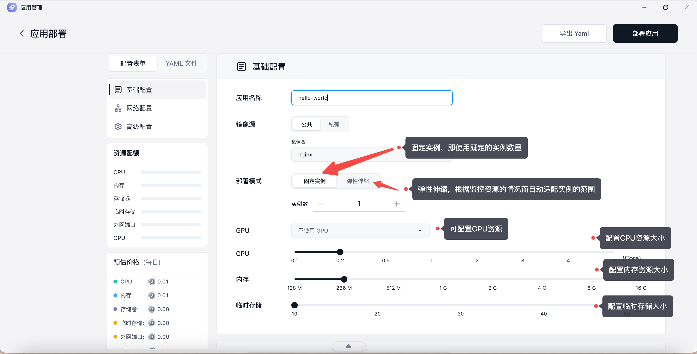
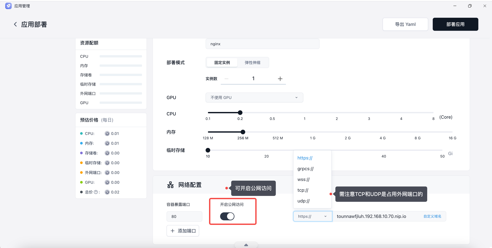
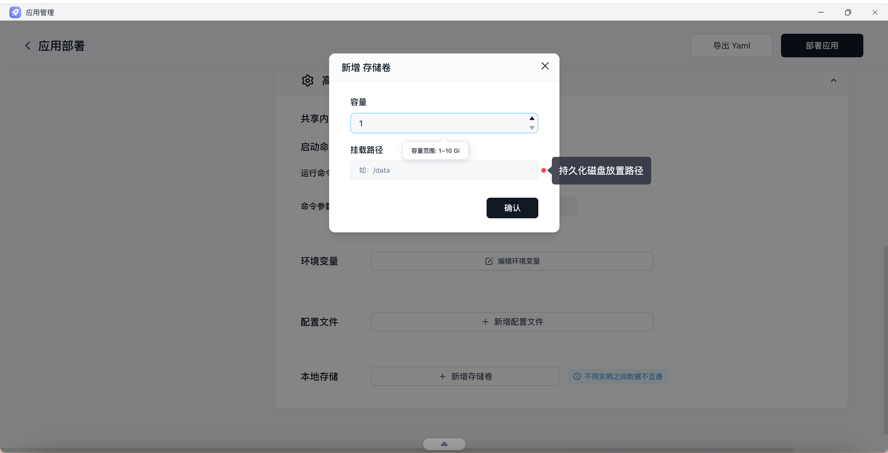
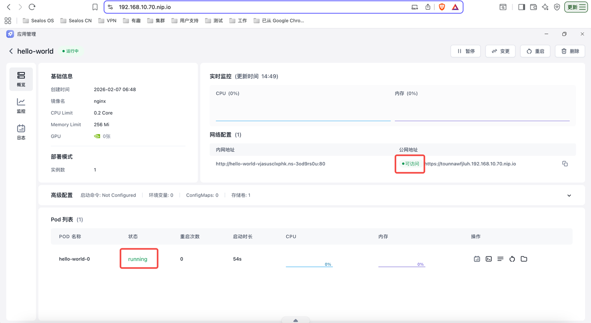

## 1. 基础配置

点击 `应用管理`，选择 `创建应用`，然后在部署表单中填写以下信息：

- 应用名称：输入应用名称
- 镜像名称：输入镜像名称
- 部署模式：选择固定实例的数量或者弹性伸缩
- 计算资源：通过滑块调整 CPU 和内存配置



## 2. 网络配置

根据应用类型选择合适的协议和暴露方式：

- `https`：适合普通 Web 页面和 API 服务
- `grpc`：适合 gRPC 服务
- `wss`：适合需要 WebSocket 的实时应用
- `tcp` / `udp`：适合非 HTTP 类协议服务

如果只是部署一个标准的 Web 服务，通常优先选择 `https` 作为外部访问方式，系统自动签发证书。



## 3. 高级配置

如果镜像已经在 `Dockerfile` 中定义好默认启动方式，通常不需要额外修改。只有在下面这些场景中，才建议显式配置命令和参数：

- 启动命令：这里可以自定义启动命令和参数
- 环境变量：这里可以自定义环境变量
- 配置文件：挂载配置文件到容器中
- 存储容量：如果容器需要持久化存储，可以设置需要挂载的存储容量
  

## 4. 部署成功



## 常见问题
打开应用日志，查看容器启动过程中的具体报错信息，确认镜像本身能启动、端口正确、主页能访问。

### 排查镜像

打开应用详情页，确认镜像是否可以正常拉取，支持国内外所有镜像仓库：

- 镜像地址正确，标签明确，建议不要依赖不稳定的 `latest`
- 应用监听的是 `0.0.0.0`，而不是容器内部的 `127.0.0.1`
- 你知道业务实际使用的端口，例如 `3000`、`8080` 或 `80`
- 如果需要自定义启动方式，你已经明确命令和参数

如果你不确定镜像是否可用，建议先在本地验证一次核心行为，例如：

```bash
docker run --rm -p 3000:3000 your-image:tag
```
