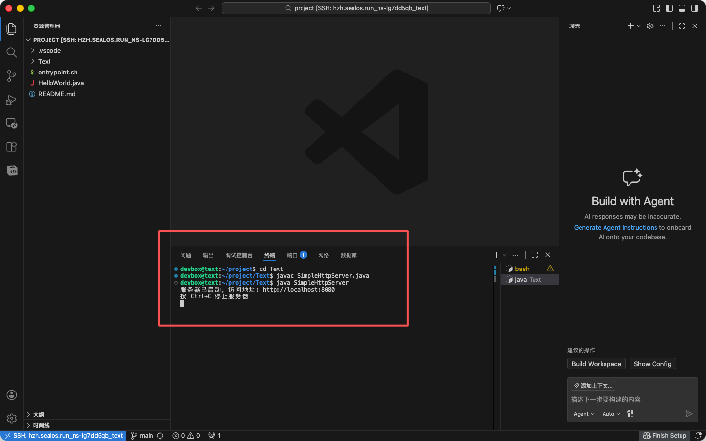

如果你的项目代码已经在本地或 GitHub / Gitee 等仓库内，只需要进入 Sealos DevBox 、导入仓库、安装依赖、启动项目、暴露预览地址即可。

## 1. 开始前准备
这些信息越明确，第一次创建 DevBox 越顺利。

- 项目文件：代码仓库 / 本地文件夹 
- 启动命令：例如 `pnpm dev`、`npm run dev`、`python manage.py runserver`
- 监听端口：例如 `3000`、`5173`、`8000`
- 私有仓库：访问授权

## 2. 创建 DevBox

选择 `DevBox` ，点击 `创建项目` ，填入基础信息。

- 环境：选择项目所需框架，可创建后补充依赖或升级版本
- 资源：开发环境建议 2C4G
- 网络：选择项目所需端口，支持多端口


## 3. 安装依赖并启动项目

进入 WebIDE、Web 终端，或者用本地 IDE 连接后，先完成最小启动流程：

1. 拖拽代码文件至目录内，或终端内 git clone 仓库
2. 安装项目依赖，配置必需的环境变量
3. 补充启动命令到 `entrypoint.sh` ，执行文件启动服务
4. 确认控制台输出中没有明显报错



```
entrypoint.sh 只负责启动应用，不应该包含构建步骤。所有的构建工作都应该在开发环境中完成。
```

## 4. 从开发走向部署

当你已经在 DevBox 中把项目跑通后，通常有两条后续路径：

- 继续作为开发环境使用：适合持续编码、调试和协作
- 发布为正式应用：适合把当前代码或构建产物接入应用管理


如果你需要长期对外提供服务，最终仍建议进入应用部署流程，而不是一直依赖开发态服务作为生产入口。

## 常见问题

### GitHub 仓库拉取失败

优先检查：

- 仓库是否为私有仓库
- 当前账号是否已完成授权
- 仓库地址、组织名、分支名是否正确

### 页面打不开但进程已启动

通常先看两点：

- 监听地址是否为 `0.0.0.0`
- DevBox 暴露的端口是否与你项目真实端口一致

### 依赖安装很慢或经常失败

先减少变量，优先确认：

- 包管理器是否正确，例如 `pnpm`、`npm`、`yarn`
- 锁文件是否与项目一致
- 是否缺少系统依赖、环境变量或私有源配置

## 下一步

- [DevBox 使用指南](/docs/guides/devbox)
- [使用源码部署复杂应用](/docs/getting-started/deploy-source-code)
- [使用 Docker 部署应用](/docs/getting-started/deploy-docker-image)
- [数据库使用指南](/docs/guides/databases)
