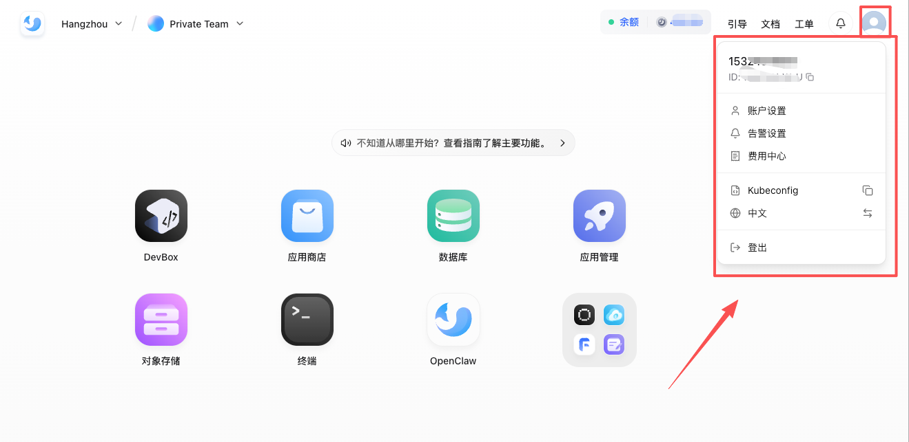
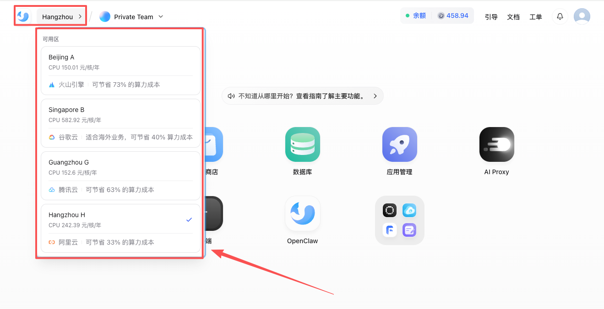
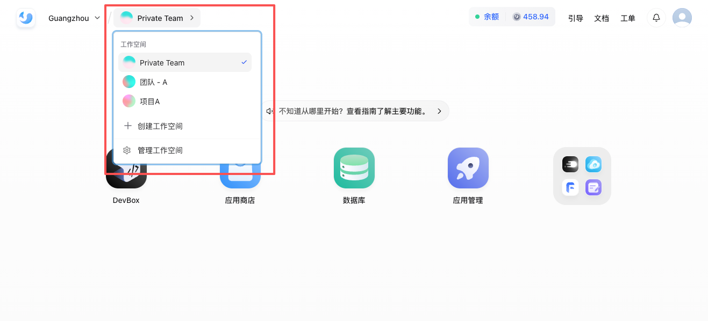

## 账号

账号用于完成登录、身份识别和基础信息绑定。常见的登录方式包括邮箱、手机号和第三方账号，但日常资源使用通常不直接挂在账号下，而是挂在工作空间下。

## 可用区

可用区或集群决定资源最终落在哪一组底层基础设施上。对于普通用户来说，这通常意味着：

- 资源延迟和访问距离不同
- 某些规格、实例或产品可用性不同

如果团队有明确的地域要求或资源规划，建议在正式创建资源前先确认目标可用区。

## 工作空间
工作空间是 Sealos 中最重要的资源边界。大多数你实际创建的内容都和工作空间绑定，例如：

- 工作空间用于隔离资源、成员和成本归属
- Owner 通常承担工作空间成本并拥有最高管理权限
- Manager 负责协作管理与资源管理
- Developer 通常具备只读或使用权限，不具备高风险操作权限

如果你发现“我明明创建过资源，但现在看不到”，首先要检查的通常不是页面刷新，而是自己是否切到了正确可用区或工作空间。

## 典型使用路径

1. 登录 Sealos
2. 确认当前可用区
3. 确认工作空间
4. 从桌面进入具体产品
5. 在创建资源前再次确认资源归属和权限

这个顺序的核心目的是减少“资源建错地方”的问题。尤其在多人协作时，先确认工作空间比直接点创建更重要。

## 步骤 1：先确认当前账号和身份

进入控制台后，先确认当前登录的账号就是你准备操作的那个账号，尤其在下面这些场景里更容易看错：

- 同时登录了多个测试账号和正式账号
- 团队代操作或共用演示机器
- 刚完成手机号、邮箱或第三方账号切换

如果账号本身就不对，后续看到的工作空间、权限和资源都会一起偏掉。

## 步骤 2：再确认目标可用区

可用区决定资源最终落在哪组底层基础设施上。创建资源前，建议先确认：

- 地域或网络延迟是否满足要求
- 目标规格、产品或资源是否在该区域开放
- 团队是否已经约定某个环境固定使用某个可用区

如果你的团队已经做了环境隔离，最好不要在创建资源时临时切区。

## 步骤 3：最后确认工作空间

工作空间是 Sealos 中最重要的资源边界。大多数日常操作都应该在真正创建资源前再确认一次工作空间，尤其是：

- 部署应用
- 创建数据库
- 启动 DevBox
- 安装模板
- 查看费用归属

只要资源、成员或费用边界应该不同，就应优先考虑切换工作空间，而不是继续复用当前空间。

## 常见问题

- 找不到以前创建过的资源：查看 [创建过资源，但找不到](/docs/guides/account-workspace/cannot-find-created-resources)
- 同事能看到资源而你看不到：查看 [为什么同事能看到，我看不到](/docs/guides/account-workspace/coworker-can-see-resources-but-i-cant)

## 推荐下一步

- 需要继续做应用部署：继续阅读 [应用管理](/docs/guides/app-management)
- 准备开始远程开发：继续阅读 [DevBox](/docs/guides/devbox)
- 想看整体能力边界：继续阅读 [功能清单](/docs/guides/feature-list)
- 准备部署第一个在线服务：继续阅读 [应用管理](/docs/guides/app-management)
- 想先快速上手具体能力：进入 [快速开始](/docs/getting-started)
