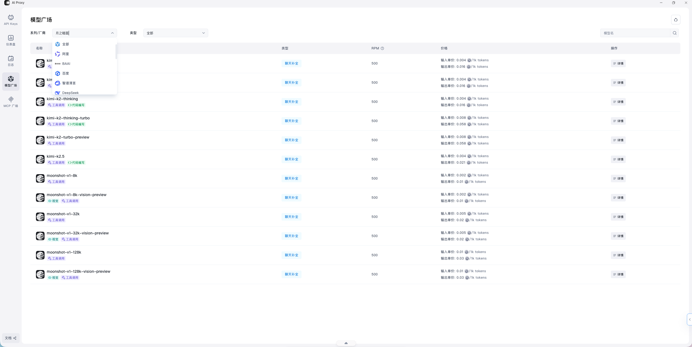

## 什么是 AI Proxy

AI Proxy 可以理解为 Sealos 上的大模型统一接入层。它的核心目标不是替代你的业务逻辑，而是把“模型接入、鉴权方式、统一接口和调用观测”标准化。


## 功能特点

- 统一 API 入口，减少不同模型服务商之间的接入差异
- 兼容 OpenAI 风格接口，便于迁移现有 SDK 和应用
- 可以集中管理 API Key、费用和调用日志
- 当你需要切换模型或补充备用模型时，接入层更稳定

## 使用流程

1. 创建 API Key
2. 确认目标模型和使用场景
3. 按 OpenAI 兼容接口接入应用
4. 做一次最小调用验证
5. 通过日志和费用趋势持续观察结果



### OpenAI 调用格式

```ts
Base-url：https://aiproxy.hzh.sealos.run/v1
API Key：sk-xxx
模型：kimi-k2.5
```

### JavaScript 调用示例

```ts
async function main() {
	const apiKey = process.env.AI_PROXY_API_KEY;
	const apiUrl = `${process.env.AI_PROXY_BASE_URL}/v1/chat/completions`;

	const response = await fetch(apiUrl, {
		method: 'POST',
		headers: {
			'Content-Type': 'application/json',
			Authorization: `Bearer ${apiKey}`,
		},
		body: JSON.stringify({
			model: 'Doubao-lite-4k',
			messages: [
				{ role: 'system', content: 'You are a helpful assistant.' },
				{ role: 'user', content: '你好，请介绍一下你自己。' },
			],
			max_tokens: 1024,
			temperature: 0.7,
		}),
	});

	if (!response.ok) {
		throw new Error(`request failed: ${response.status}`);
	}

	const data = await response.json();
	console.log(data.choices?.[0]?.message?.content);
}

main().catch(console.error);
```

上面的 `AI_PROXY_BASE_URL` 和 `AI_PROXY_API_KEY` 建议都放在环境变量里，不要直接写死在代码仓库中。

## 请求参数

| 参数 | 类型 | 说明 | 示例 |
| --- | --- | --- | --- |
| `model` | `string` | 要调用的模型名称 | `Doubao-lite-4k` |
| `messages` | `array` | 对话消息列表 | `[{ "role": "user", "content": "你好" }]` |
| `max_tokens` | `number` | 最大生成 token 数量 | `1024` |
| `temperature` | `number` | 输出随机性，通常越高越发散 | `0.7` |


## 日志计费

AI Proxy 不只是用来“发请求”，还适合持续看下面这些信息：

- 某个 API Key 的调用情况
- 某个模型的调用次数和消耗
- 某段时间内的请求趋势
- 某次失败请求的具体错误信息


## 常见问题

### API 调用失败时先看什么

建议按下面顺序检查：

1. API Key 是否正确
2. API Endpoint 是否配置正确
3. 模型名称是否可用
4. 请求参数格式是否符合接口要求
5. 日志里是否已经给出明确错误信息

### 为什么有调用但效果不好

优先区分是“调用失败”还是“结果质量不理想”。

如果请求已经成功返回，但结果不符合预期，通常先检查：

- 模型是否适合当前任务
- `temperature` 是否过高或过低
- prompt 是否清晰
- 上下文是否过长或信息不足

### 费用突然升高时怎么看

优先结合趋势和日志判断是不是下面几种情况：

- 某个应用流量突然放大
- 某个模型被高频调用
- 某类失败请求发生了反复重试
- `max_tokens` 或上下文长度设置过大

