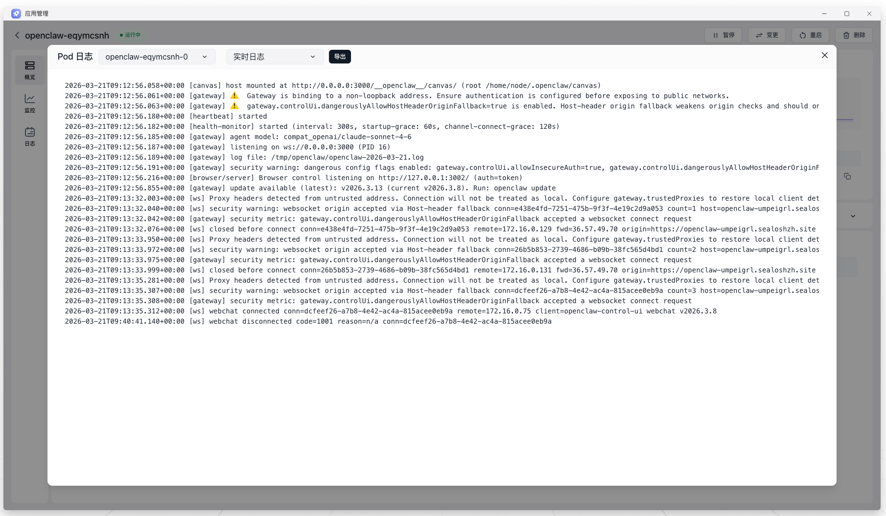

这种情况通常说明容器已经被成功创建，但业务进程没有持续运行，一般集中在启动命令、环境变量、监听端口或依赖文件上。

## 排查顺序

1. 先看日志，确认是命令报错、配置缺失还是依赖资源不存在
2. 再核对镜像默认启动方式是否被覆盖
3. 检查环境变量、配置文件和挂载目录是否完整
4. 最后核对端口和探针配置

## 常见原因
根据具体报错信息排查

- 启动命令不对，或者覆盖了镜像里原本正确的默认入口
- 必需环境变量缺失，导致服务初始化失败
- 端口配置不一致，配套探针和访问链路随之失败
- 依赖文件、挂载目录或配置文件不存在

