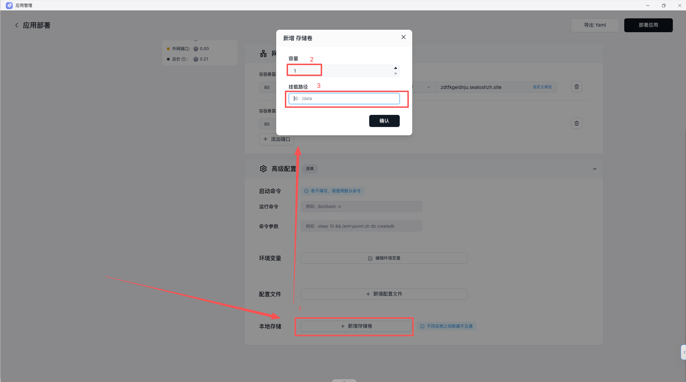

这通常意味着数据写在容器临时文件系统里，而没有挂载持久化存储。容器一旦重建，临时文件就会一起消失。

## 先判断是不是这类问题

- 丢失的数据是否原本写在容器内部目录
- 应用是否配置了存储卷
- 这个目录是否真的是业务数据目录，而不是缓存目录

## 常见原因

- 数据直接写进了容器临时文件系统
- 已经配置存储卷，但挂载路径和真实写入路径不一致
- 多实例下仍然依赖本地写入，实例之间天然不共享

## 建议排查顺序

1. 先确认业务实际写入的是哪个目录
2. 再确认该目录是否已经挂载持久化存储
3. 如果已挂载，检查挂载路径是否和应用真实写入路径一致
4. 如果已扩容多实例，评估是否应该改为对象存储、数据库或共享存储方案

## 下一步

- 想回到完整使用路径：返回 [应用管理](/docs/guides/app-management)
- 需要设计持久化方案：继续阅读 [对象存储](/docs/guides/object-storage)
