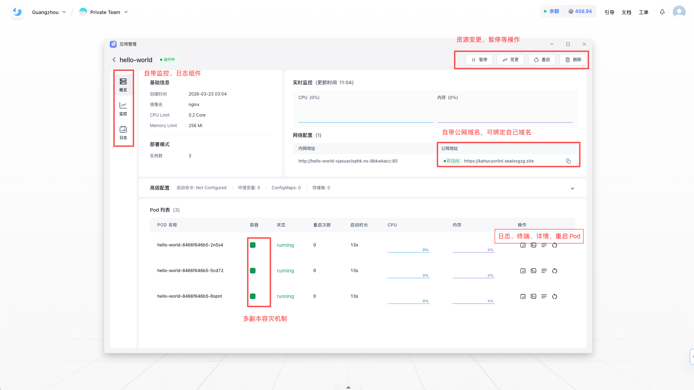
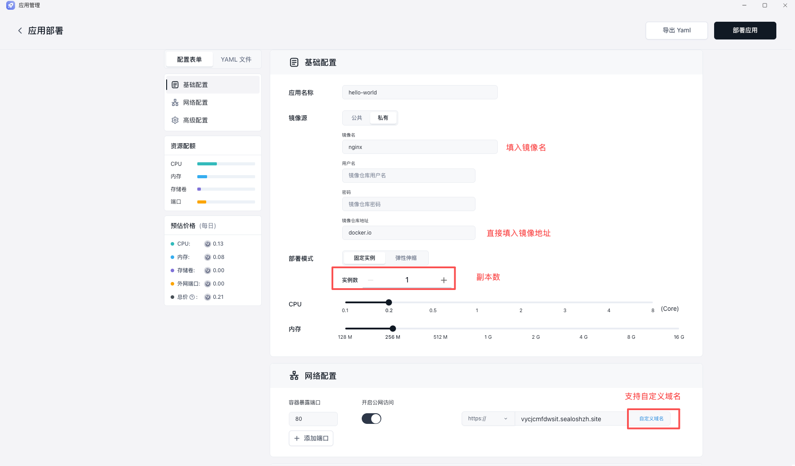
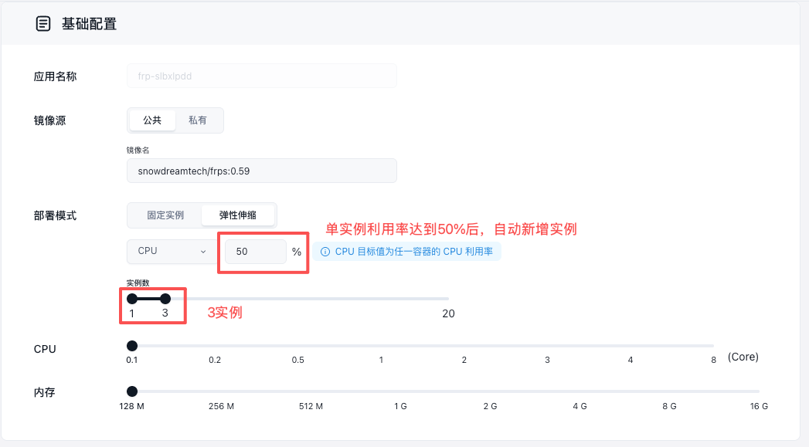

## 什么是应用管理?

应用管理可以理解为 Sealos 上最通用的在线部署入口。它的核心目标是把“已有镜像如何稳定运行、暴露访问、持续运维”这件事标准化。

如果你的镜像已经能在本地通过 `docker run` 正常启动，通常就可以继续在 Sealos 里完成：

- 部署为长期运行的在线服务
- 配置公网访问或内部访问
- 调整资源和实例数
- 查看运行状态、日志和事件
- 通过变更功能持续发布新版本



## 部署流程

### 1. 准备可用镜像

先确认镜像本身能启动、端口正确、主页能访问：

- 镜像地址正确，标签明确，不要依赖不稳定的 `latest`
- 应用监听的是 `0.0.0.0`，而不是容器内部的 `127.0.0.1`
- 你知道业务实际使用的端口，例如 `3000`、`8080` 或 `80`
- 如果需要自定义启动方式，你已经明确命令和参数


#### 本地验证

```bash
docker run --rm -p 3000:3000 your-image:tag
```

### 2. 填入镜像信息

创建流程建议按下面顺序完成：

1. 进入 Sealos 控制台，切换到目标工作空间
2. 打开应用管理，创建新应用
3. 选择通过 Docker 镜像部署
4. 填写应用名称和镜像地址
5. 如果使用私有镜像，补充仓库认证信息



### 3. 配置资源

应用创建时，最核心的配置通常有三类：部署模式、实例数和资源规格。

#### 部署模式

- 固定实例：适合稳定流量或长期在线服务
- 弹性伸缩：适合流量波动明显、希望按负载自动调节实例数的服务

#### 实例数

- 单实例适合演示环境、内部工具或无状态的轻量服务
- 多实例适合有高可用需求或需要更高并发能力的服务



### 4. 配置域名

当镜像可以正常运行后，下一步就是决定服务如何被访问。

#### 端口

- 至少配置应用真正监听的端口
- 如果应用包含多个服务，可以按需要开放多个端口
- 仅供内部依赖的端口，不一定需要暴露到公网

#### 访问方式

根据应用类型选择合适的协议和暴露方式：

- `https`：适合普通 Web 页面和 API 服务
- `grpc`：适合 gRPC 服务
- `wss`：适合需要 WebSocket 的实时应用
- `tcp` / `udp`：适合非 HTTP 类协议服务

如果只是部署一个标准的 Web 服务，通常优先选择 `https` 作为外部访问方式。

#### 验证思路

端口配置完成后，建议按下面顺序判断问题：

1. 容器是否真的启动成功
2. 应用是否监听了你配置的端口
3. 协议是否和服务本身一致
4. 是否已经正确打开公网访问

### 5. 配置运行命令、环境变量和存储

这一部分决定应用是不是能以你预期的方式运行。

#### 启动命令与参数

如果镜像已经在 `Dockerfile` 中定义好默认启动方式，通常不需要额外修改。只有在下面这些场景中，才建议显式配置命令和参数：

- 一个镜像需要兼容多种启动模式
- 你要覆盖默认的 `ENTRYPOINT` 或 `CMD`
- 你希望在不同环境下传入不同参数

#### 环境变量

环境变量适合管理下面这类信息：

- 服务运行模式
- 外部依赖地址
- 功能开关
- 非敏感配置项

在平台中配置环境变量时，建议遵循两个原则：

- 名称清晰，避免临时命名
- 区分必填项和可选项，减少排障成本

#### 配置文件

如果应用依赖结构化配置文件，可以在平台中新增、删除和维护对应内容。适合放入配置文件的通常是：

- 大段结构化配置
- 多层级服务参数
- 不适合拆成大量环境变量的内容

#### 存储卷

如果你的应用会写入上传文件、缓存、模型、数据库文件或运行时产物，建议在这里直接配置存储卷，避免容器重建后数据丢失。

常见需要持久化的目录包括：

- 用户上传目录
- 数据库存储目录
- 模型或素材目录
- 任务执行产生的结果目录

### 6. 发布应用并验证结果

完成配置后，就可以正式创建并等待应用启动。

建议你至少检查下面四项：

- 应用概览里是否显示实例已正常运行
- 访问地址是否能正常打开
- 日志里是否出现启动成功信息
- 事件里是否存在镜像拉取失败、启动失败或探针异常等报错

如果应用能打开，但功能不正常，优先看日志；如果应用根本没起来，优先看事件。

## 部署后还能继续做什么

应用管理不仅用于“第一次创建”，也用于后续持续运维。

### 查看应用概览

概览页面通常适合快速确认：

- 当前镜像版本
- 资源规格
- 实例数
- 网络和访问入口

### 查看日志和事件

日志适合定位应用内部错误，例如：

- 启动报错
- 依赖连接失败
- 环境变量缺失
- 代码异常

事件更适合定位平台层问题，例如：

- 镜像拉取失败
- 调度失败
- 资源不足
- 容器反复重启

### 进入终端

如果应用已经启动，但你需要进一步确认文件、进程、环境变量或网络连通性，可以直接进入网页终端做临时检查。

### 变更配置

当你需要发布新版本或调整资源时，可以直接在已有应用上做变更，例如：

- 更换镜像标签
- 调整 CPU、内存或 GPU
- 修改端口
- 更新环境变量或配置文件

相比重新创建应用，这样更适合持续迭代。

### 重启、暂停与删除

- 重启：适合配置更新后快速恢复运行状态
- 暂停：适合临时停用不需要持续运行的服务
- 删除：适合确认不再需要的应用，平台会要求二次确认

如果你关心暂停或删除后的费用影响，建议同时阅读 [费用与账户](/docs/billing/account-and-billing)。

### YAML 预览与导出

如果你希望审查部署结果，或者需要把当前配置沉淀为可交付内容，可以使用 YAML 预览与导出能力。它适合下面几类场景：

- 交付给平台管理员复核
- 作为版本变更记录保留
- 在团队内部复用相似配置

## 问题排查

如果你已经知道当前故障现象，可以直接进入对应页面：

- [镜像拉取失败](/docs/guides/app-management/image-pull-failed)
- [应用启动后立刻退出](/docs/guides/app-management/app-exits-immediately)
- [页面打不开，但实例显示运行中](/docs/guides/app-management/page-unreachable)
- [重启后数据丢失](/docs/guides/app-management/data-lost-after-restart)
- [什么时候需要看私有云文档](/docs/guides/app-management/when-to-use-private-cloud)

## 推荐下一步

- 第一次上手用户：继续阅读 [使用 Docker 部署应用](/docs/getting-started/deploy-docker-image)
- 需要多人协作：继续阅读 [访问入口与工作空间](/docs/guides/account-workspace)
- 需要了解成本和余额：继续阅读 [费用与账户](/docs/billing/account-and-billing)
