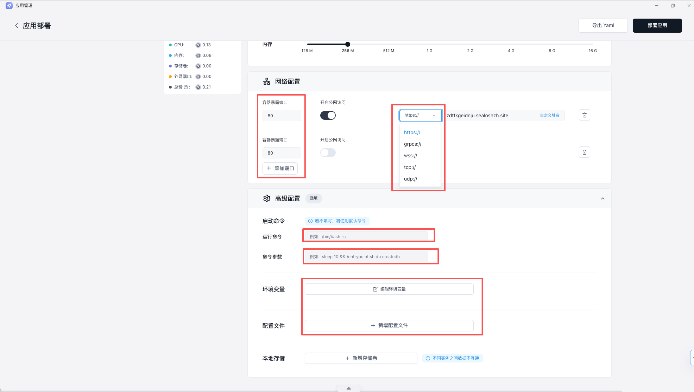

这类问题通常不是“应用没启动”，而是访问链路某个环节没有对齐。重点看监听地址、端口、协议和入口配置。

## 优先确认

- 应用是否监听 `0.0.0.0`
- 暴露端口是否和容器实际端口一致
- 访问协议是否选对
- 首页路由或健康检查是否正常

## 常见原因

- 只监听了 `127.0.0.1`，导致外部链路访问不到
- 平台暴露端口和业务真实监听端口不一致
- 协议选择不匹配，尤其是 gRPC、WebSocket 或非 HTTP 服务
- 首页路由、重定向或健康检查路径异常

## 建议排查顺序

1. 先确认应用实际监听地址和端口
2. 再核对平台暴露端口与协议
3. 查看应用日志，确认请求是否进入服务
4. 最后检查首页路由、重定向和健康检查路径