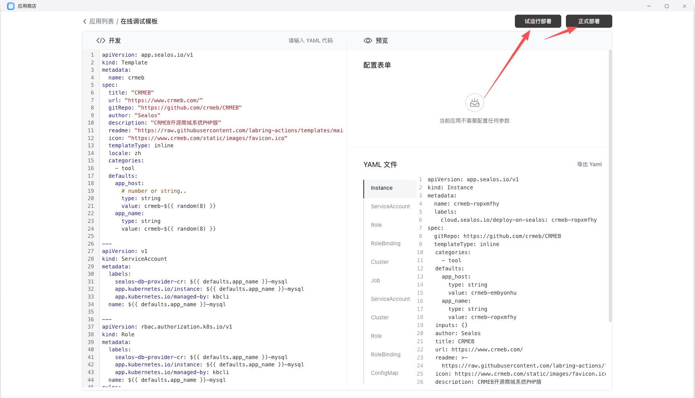

## 模板文件通常长什么样

Sealos 应用模板通常用一个 `template.yaml` 文件描述，它既包含模板元信息，也包含实际部署所需的 Kubernetes 资源。

一个常见模板会包含这些部分：

- `Template`：定义模板名称、图标、描述、分类和输入项
- `StatefulSet` 或其他工作负载资源：定义应用实例如何运行
- `Service`：定义集群内访问方式
- `Ingress`：定义对外访问入口
- `App`：定义 Sealos 控制台里的应用展示信息

## 先看一个完整示例

下面这份 `template.yaml` 适合作为起点。你不需要一开始理解每一行，但应该先建立“模板由哪些资源组成”的整体认知。

### template.yaml

```yaml
# Sealos Application Template Reference
#
# This file serves as a template reference for creating Sealos application templates.
# Copy this file and customize it for your application.
#
# Required fields are marked with [REQUIRED]
# Fill in the placeholders with your application-specific information.

---
apiVersion: app.sealos.io/v1
kind: Template
metadata:
  name: myapp-template
spec:
  # Application metadata
  title: ""                               # [REQUIRED] Application display name
  url: ""                                 # [REQUIRED] Your app's official website
  gitRepo: ""                             # [REQUIRED] Your app's GitHub repository URL
  author: ""                              # [REQUIRED] Your name or organization
  description: ""                         # [REQUIRED] Brief description of your app
  readme: 'https://raw.githubusercontent.com/labring-actions/templates/main/template/<app-name>/README.md'  # Update <app-name> with actual app name
  icon: ""                                # [REQUIRED] URL to your app's icon
  templateType: inline                    # Template type: inline (all resources in one file)
  locale: en
  i18n:
    zh:
      title: '应用标题'                     # Chinese title for your app
      description: '应用描述'                # Chinese description for your app
  categories:
    - tool                                # [REQUIRED] Choose from: ai, database, tool, low-code, blog, storage, frontend, backend, dev-ops, monitor, game

  # Default values for template variables
  defaults:
    app_host:
      type: string
      value: myapp-${{ random(8) }}      # Replace "myapp" with your app's name prefix
    app_name:
      type: string
      value: myapp-${{ random(8) }}      # Replace "myapp" with your app's name prefix

  # User-configurable inputs (will be rendered as form fields)
  inputs:
    volume_size:
      description: "Persistent storage size (GiB)"
      type: string
      default: "1"
      required: false
    # Add more inputs as needed, e.g.:
    # - app_password:
    #     description: "Admin password"
    #     type: string
    #     required: true

---
# StatefulSet - Manages your application pods
apiVersion: apps/v1
kind: StatefulSet
metadata:
  name: ${{ defaults.app_name }}
  annotations:
    originImageName: ""                   # [REQUIRED] Your app's Docker image URL
    deploy.cloud.sealos.io/minReplicas: "1"
    deploy.cloud.sealos.io/maxReplicas: "1"
  labels:
    cloud.sealos.io/app-deploy-manager: ${{ defaults.app_name }}
    app: ${{ defaults.app_name }}
spec:
  replicas: 1
  revisionHistoryLimit: 1
  minReadySeconds: 10
  serviceName: ${{ defaults.app_name }}
  selector:
    matchLabels:
      app: ${{ defaults.app_name }}
  template:
    metadata:
      labels:
        app: ${{ defaults.app_name }}
    spec:
      terminationGracePeriodSeconds: 10
      automountServiceAccountToken: false  # Security: disable service account token mounting
      containers:
        - name: ${{ defaults.app_name }}
          image: ""                       # [REQUIRED] Your app's Docker image URL
          env: []                         # Environment variables (add as needed)
          resources:
            requests:
              cpu: 100m
              memory: 128Mi
            limits:
              cpu: 1000m
              memory: 1024Mi
          command: []                     # Override entrypoint if needed
          args: []                        # Command arguments
          ports:
            - containerPort: 80           # [REQUIRED] Your app's internal port
          imagePullPolicy: IfNotPresent
          volumeMounts:
            - name: data-volume
              mountPath: /app/data        # Path where your app stores data
      volumes: []                         # Additional volumes (if any)
  volumeClaimTemplates:
    - metadata:
        annotations:
          path: /app/data                 # Path to store persistent data
          value: "1"
        name: data-volume
      spec:
        accessModes:
          - ReadWriteOnce
        resources:
          requests:
            storage: ${{ inputs.volume_size }}Gi

---
# Service - Exposes your application within the cluster
apiVersion: v1
kind: Service
metadata:
  name: ${{ defaults.app_name }}
  labels:
    cloud.sealos.io/app-deploy-manager: ${{ defaults.app_name }}
spec:
  ports:
    - port: 80                           # Service port (usually same as containerPort)
  selector:
    app: ${{ defaults.app_name }}

---
# Ingress - Exposes your application to the internet
apiVersion: networking.k8s.io/v1
kind: Ingress
metadata:
  name: ${{ defaults.app_name }}
  labels:
    cloud.sealos.io/app-deploy-manager: ${{ defaults.app_name }}
    cloud.sealos.io/app-deploy-manager-domain: ${{ defaults.app_host }}
  annotations:
    kubernetes.io/ingress.class: nginx
    nginx.ingress.kubernetes.io/proxy-body-size: 32m
    nginx.ingress.kubernetes.io/server-snippet: |
      client_header_buffer_size 64k;
      large_client_header_buffers 4 128k;
    nginx.ingress.kubernetes.io/ssl-redirect: "false"
    nginx.ingress.kubernetes.io/backend-protocol: HTTP
    nginx.ingress.kubernetes.io/rewrite-target: /$2
    nginx.ingress.kubernetes.io/client-body-buffer-size: 64k
    nginx.ingress.kubernetes.io/proxy-buffer-size: 64k
    nginx.ingress.kubernetes.io/configuration-snippet: |
      if ($request_uri ~* \.(js|css|gif|jpe?g|png)) {
        expires 30d;
        add_header Cache-Control "public";
      }
spec:
  rules:
    - host: ${{ defaults.app_host }}.${{ SEALOS_CLOUD_DOMAIN }}
      http:
        paths:
          - pathType: Prefix
            path: /()(.*)
            backend:
              service:
                name: ${{ defaults.app_name }}
                port:
                  number: 80
  tls:
    - hosts:
        - ${{ defaults.app_host }}.${{ SEALOS_CLOUD_DOMAIN }}
      secretName: ${{ SEALOS_CERT_SECRET_NAME }}

---
# App - Application metadata for Sealos UI (must be the last resource)
apiVersion: app.sealos.io/v1
kind: App
metadata:
  name: ${{ defaults.app_name }}
  labels:
    cloud.sealos.io/app-deploy-manager: ${{ defaults.app_name }}
spec:
  data:
    url: https://${{ defaults.app_host }}.${{ SEALOS_CLOUD_DOMAIN }}
  displayType: normal
  icon: ""                                # [REQUIRED] URL to your app's icon
  name: ""                                # [REQUIRED] Application display name
  type: link
```

## 参数详解

### 1. Template 元信息

这部分决定模板在应用商店里如何展示。建议重点填清楚：

- `title`：应用展示名称
- `description`：一句话说明用途
- `icon`：应用图标
- `categories`：分类，影响模板筛选和归档
- `readme`：建议提供完整安装说明和使用说明

如果这些信息写得太弱，模板即使可安装，后续也很难被团队稳定复用。

### 2. defaults 默认值

`defaults` 适合定义模板里内部要反复使用的变量，例如：

- 应用名
- 域名前缀
- 默认实例名

建议把会在多个资源间复用的值都提取出来，减少重复手改和命名不一致。

### 3. inputs 用户输入项

`inputs` 会在安装时渲染成表单，适合让用户填写：

- 存储大小
- 管理员密码
- 外部访问域名
- API Key 或初始化参数

并不是所有变量都应该暴露成输入项。只有“用户安装时确实需要决定”的部分，才值得放到 `inputs`。

### 4. 工作负载资源

示例里使用的是 `StatefulSet`，它适合需要稳定身份或持久化存储的应用。

如果你的应用只是简单无状态服务，也可以根据实际场景调整为更合适的工作负载类型。关键是：

- 镜像地址明确
- 端口暴露正确
- 启动命令和参数可控
- 持久化目录与存储声明一致

### 5. Service、Ingress 和 App

- `Service` 负责集群内访问
- `Ingress` 负责对外访问和域名暴露
- `App` 负责 Sealos 控制台中的应用展示与跳转入口

很多模板安装后“能跑但不好用”，问题往往不在镜像本身，而在这三部分没有对齐。


## 在线调试模板

写完模板后，不要直接发布，建议先走一轮在线调试。

## 在线调试路径

1. 打开应用商店
2. 进入 `我的应用`
3. 打开目标应用的 `在线调试`
4. 粘贴或修改 `template.yaml`
5. 点击 `试运行部署`
6. 填写表单项并验证实例是否成功创建
7. 确认访问入口、端口、存储和初始配置都正常后，再正式部署



如果试运行阶段就已经出现镜像拉取失败、端口不通或首页打不开，不要急着发版，先回到模板定义里修基础问题。

## 常见问题

### 为什么模板能部署但页面打不开

优先检查：

- 容器内部端口是否和 `Service` / `Ingress` 一致
- 应用是否监听了正确地址，例如 `0.0.0.0`
- 路径重写和域名配置是否合理


