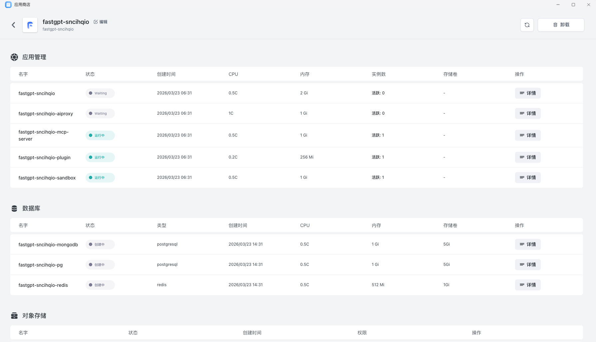

应用商店提供了一系列预制的应用模板，支持快速创建和部署各种网站及应用程序。这些模板包括博客、AI 应用、低代码应用、网盘、即时通讯应用、中间件等，旨在简化开发过程，让开发者无需从零开始构建项目或处理应用之间的依赖关系。

模板通常不仅是一张镜像，而是一套更完整的交付内容，可能包含：

- 应用基础说明
- 默认配置
- 依赖关系
- 服务暴露方式
- 安装后的状态检查方式

对于普通用户来说，应用商店更像“即装即用入口”；对平台团队来说，它也是标准化交付的沉淀层。

## 使用场景

模板化的核心价值不是“替代所有部署方式”，而是把高频、可复用的交付流程产品化。

- 团队反复部署同一业务系统
- 每次交付都要重复填写大量配置
- 你希望不同环境都使用统一安装标准
- 需要把版本升级流程、依赖关系和说明文档一起固化

