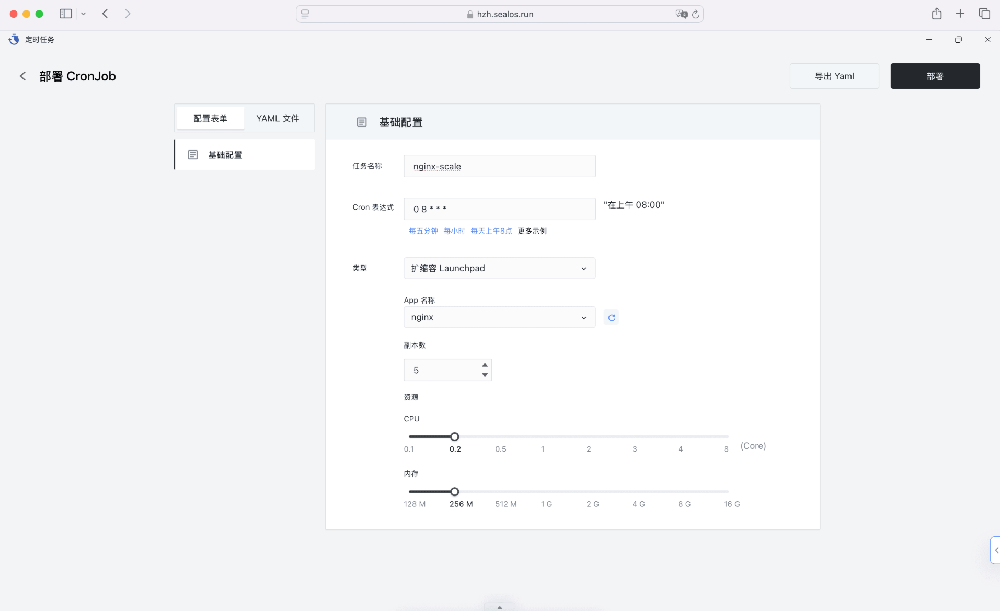

## 什么是定时任务

Sealos 中的定时任务通常适合下面几类动作：

- 按计划访问某个 URL
- 按计划执行应用扩缩容
- 按计划在目标环境中执行命令

这类任务的共同点是“动作明确、执行时间固定、执行后不需要长期常驻”。

## 配置示例：

- 任务名称：输入易识别的名称，如“nginx-scale”
- 类型：选择任务类型
- 扩缩容 Launchpad：对应用实例进行扩缩容
- 访问 URL：访问指定 URL 地址
- 执行命令：执行自定义命令
- Cron 表达式：使用 Cron 表达式设置执行时间 (基于北京时间)
- App 名称：当类型为 扩缩容 Launchpad 时，指定需要扩缩容的目标应用
- 副本数：当类型为 扩缩容 Launchpad 时，指定需要扩缩容的目标实例数量

