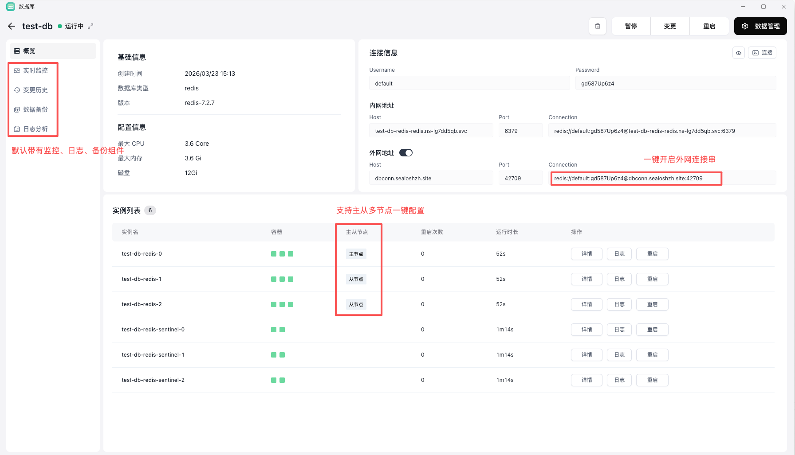

Sealos 数据库可以理解为平台内的托管数据库入口。它的核心目标不是替代你对数据库本身的理解，而是把“实例创建、资源配置、连接方式、备份监控和日常变更”标准化。

- 选择数据库类型
- 配置资源和存储
- 获取连接方式
- 查看日志、监控和备份
- 做变更、重启和恢复

## 典型使用路径

1. 选择数据库类型
2. 配置资源、磁盘和参数
3. 创建实例并确认连接方式
4. 观察日志、监控和备份状态
5. 在后续运行中做变更、重启或恢复

查看部署教程：[部署数据库](/docs/getting-started/create-database)

## 常见问题

### 创建完成后连不上数据库

优先检查：

- 连接方式是否选对
- 地址、端口和账号信息是否正确
- 数据库实例是否真的启动完成

### 什么时候应该先看监控

当你遇到下面这些问题时，优先看监控通常更有效：

- 响应慢
- 连接数异常
- CPU、内存或磁盘明显吃满

