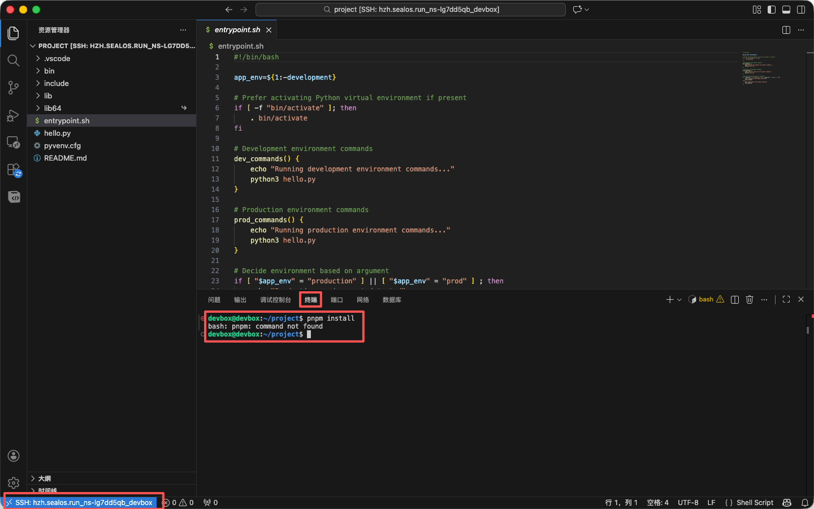

如果你的 DevBox 已经创建完成，但项目还不能直接运行，通常下一步就是补充依赖、安装系统包，或者升级语言与工具链版本。

## 打开终端

- 使用本地 IDE 连接到 DevBox
- 或直接进入 WebIDE / Web 终端
- 在项目目录执行安装命令
- 完成后用 `node -v`、`python --version`、`pnpm -v` 等命令确认结果

## 依赖安装很慢或经常失败

- 包管理器是否正确，例如 `pnpm`、`npm`、`yarn`
- 锁文件是否与项目一致
- 是否缺少系统依赖、环境变量或私有源配置
- 是否需要切换镜像源或补充网络访问能力

如果你无法判断问题来自依赖本身还是环境本身，建议先用最小命令验证，例如只执行一次 `pnpm install` 或 `pip install -r requirements.txt`，不要同时修改太多变量。

## 什么时候需要升级运行时

以下场景通常需要调整版本：

- 项目要求特定 Node、Python、Go 或 Java 版本
- 锁文件和当前运行时不兼容
- 本地能运行，但 DevBox 中出现语法或构建错误
- 团队准备把环境沉淀为统一模板

升级完成后，建议至少再验证四件事：

- 依赖是否能重新安装成功
- 启动命令是否仍然可用
- 项目预览端口是否正常监听
- 团队内是否需要同步更新模板或文档
