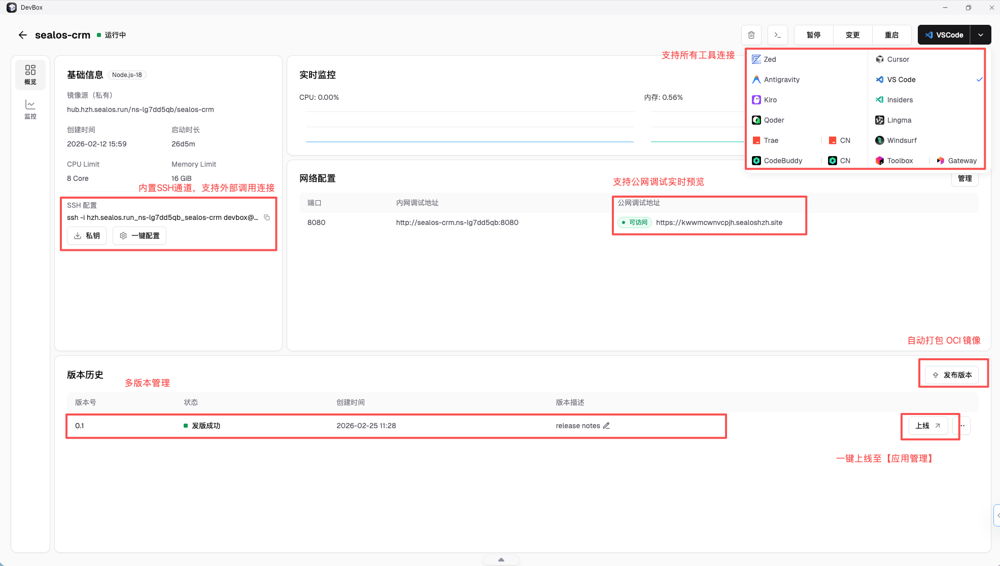

## 什么是 DevBox

DevBox 可以理解为 Sealos 上的云端开发环境入口。它的核心目标不是替代所有本地开发，而是把“环境准备、远程连接、在线开发和从开发到发布的衔接”标准化。

## 使用路径

适合项目持续开发、调试或团队需要统一环境的阶段。

1. 将你的应用所需的所有内容（包括运行环境、依赖和配置）创建成一个云容器
2. 通过 Cursor 等主流 IDE 直接访问
3. 利用公网地址，在云端完成开发、测试和联调
4. 一键打包为标准的 OCI 镜像并进行版本管理
5. 一键将应用程序部署到 Sealos Cloud，实现快速上线

