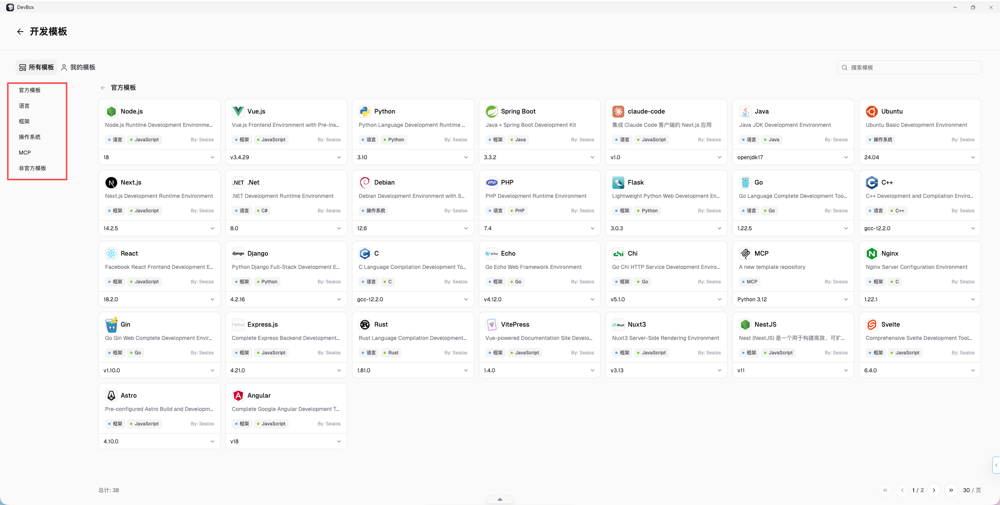
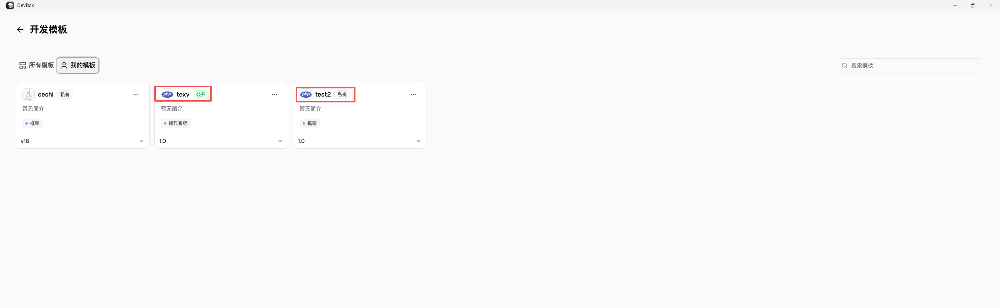

## 什么是 Devbox 模板？

DevBox 模板中心适合把已经验证过的开发环境沉淀下来，避免每次新建项目都重新安装依赖、配置工具链和调整启动方式。

### 使用场景

- 团队会反复创建同一类开发环境
- 新成员加入时，总要重复安装一批语言和工具
- 项目对 Node、Python、系统库或 CLI 版本要求严格
- 你已经把一个 DevBox 环境调试稳定，准备长期复用

### 公共 / 私有模板的区别

模板里包含账号、密钥、私有源信息或不适合公开的默认配置，不要直接发布为公共模板。

- 公共模板：所有用户可见，适合通用环境或希望公开复用的标准模板
- 私有模板：仅创建者可见，适合个人项目、实验环境或含有内部约定的配置

## 如何从现有 DevBox 创建模板

1. 打开目标 DevBox 项目，进入 `版本历史`
2. 找到已经验证可用的版本，点击右侧 `更多`
3. 选择 `转换为模板`
4. 填写模板名称、版本、公开性、标签和简介
5. 创建完成后，先用新模板再创建一次环境，确认依赖、启动命令和端口配置都正常

## 填写模板信息时建议怎么写

- 名称：建议包含语言、框架和用途，例如 `node-nextjs-dev`、`python-ml-base`
- 版本：尽量和运行时或项目阶段对应，方便后续升级和回滚
- 公开性：确认是否适合所有用户可见；当前平台规则下，公开后通常不再改回私有
- 标签：按语言、场景或用途分类，便于后续筛选
- 简介：写清模板用途、默认端口、预装工具和使用前提

## 如何使用模板创建新环境

1. 创建新项目时，进入 `运行环境`
2. 在 `所有模板` 或 `我的模板` 中选择目标模板
3. 确认模板已经显示为当前环境
4. 再补充资源、网络和代码来源等项目参数
5. 创建完成后，优先验证依赖安装、启动命令和预览地址

## 管理模板时建议注意什么

- 只把已经验证稳定的环境沉淀成模板
- 发布前清理个人账号、密钥和不应共享的本地配置
- 用统一命名方式管理语言、框架和版本号
- 模板发生较大变化时，优先新增版本，而不是覆盖旧版本

## 推荐下一步

- 想先了解 DevBox 的整体能力：继续阅读 [DevBox 使用指南](/docs/guides/devbox)
- 想从仓库快速启动项目：继续阅读 [导入代码仓库并启动项目](/docs/guides/devbox/code-server)
- 想补充依赖或升级环境版本：继续阅读 [安装依赖与升级运行时](/docs/guides/devbox/faq-codepull)
