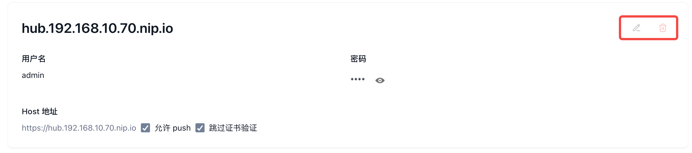
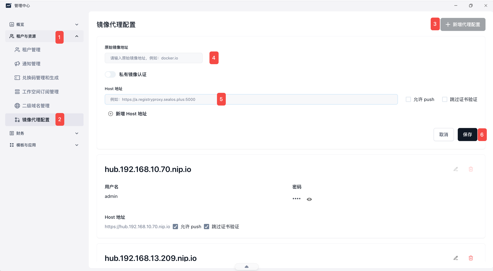
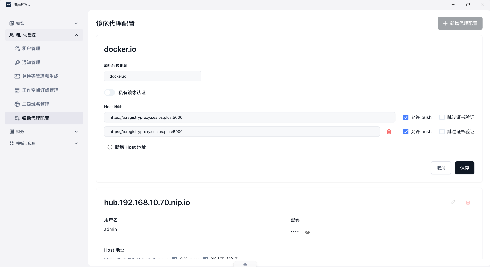
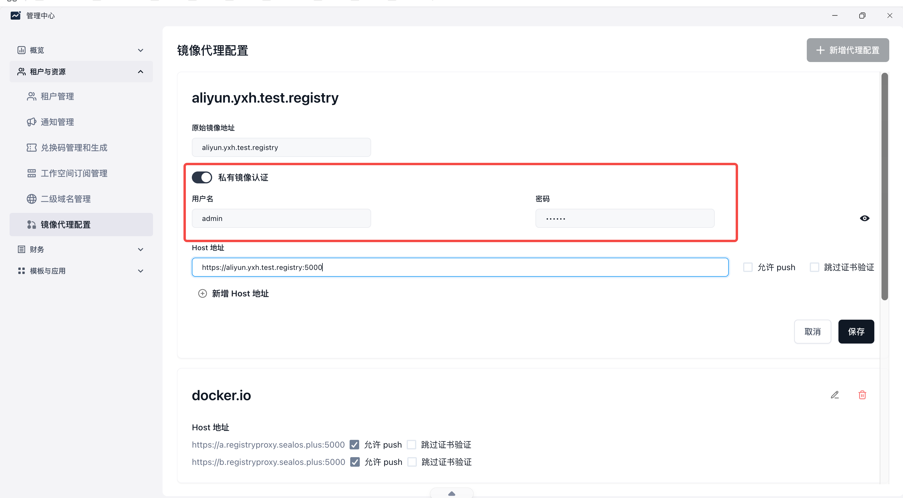

## 概念须知

- `pull`：允许拉取镜像
- `resolve`：是否代理镜像名解析或元数据解析，决定能不能查询镜像实际指向什么
- `push`：允许推送镜像
- 跳过证书验证：访问上游仓库或代理仓库时，不校验 `TLS/HTTPS` 证书。即使证书报错也会强制连接，但不安全

注意：

- `hub.<域名>` 的配置是系统默认配置，不可修改

## 操作详情

新增镜像代理时，只需要将页面中的各项配置填写清楚并保存即可。

建议重点确认以下内容：

- 请求地址是否指向正确的上游镜像仓库
- 是否需要开启 `push`
- 是否需要开启私有镜像认证
- 如果上游仓库证书异常，是否确实需要启用跳过证书验证

## 示例

### 公有镜像

下面以 `docker.io` 的代理为例：

1. 配置好请求地址并保存
2. 保存后，即可去应用管理尝试拉取该代理下的镜像

### 私有镜像

配置私有镜像代理时：

1. 打开私有镜像认证开关
2. 根据上游私有仓库的配置，填入认证信息并保存

如果上游仓库使用的是自签名证书，且当前环境无法完成证书校验，可以临时启用跳过证书验证，但不建议作为长期配置。

