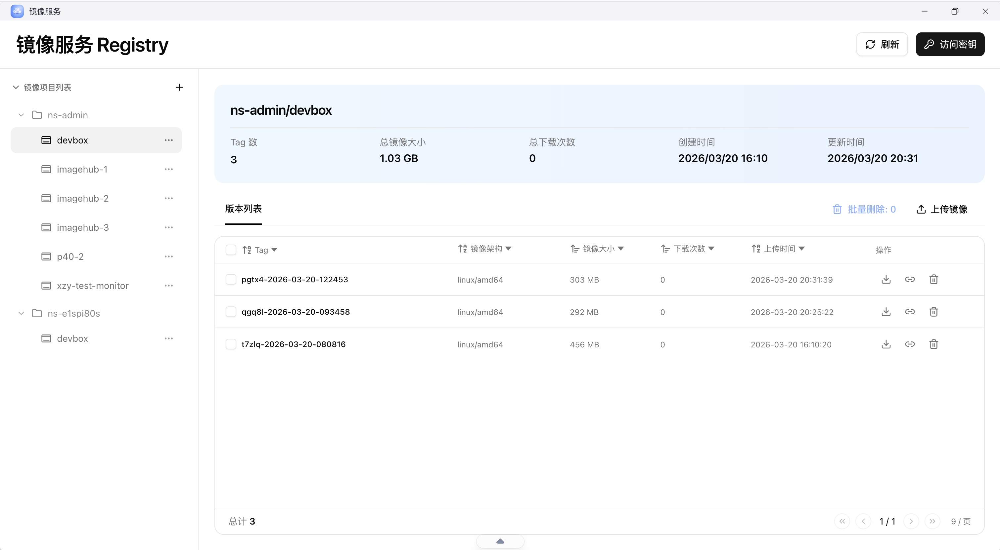
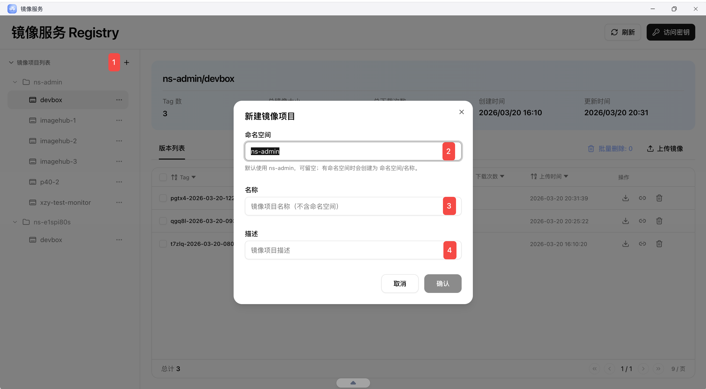
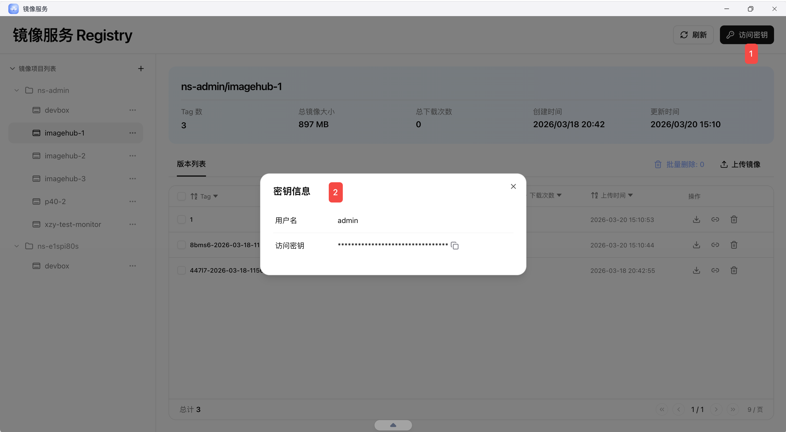
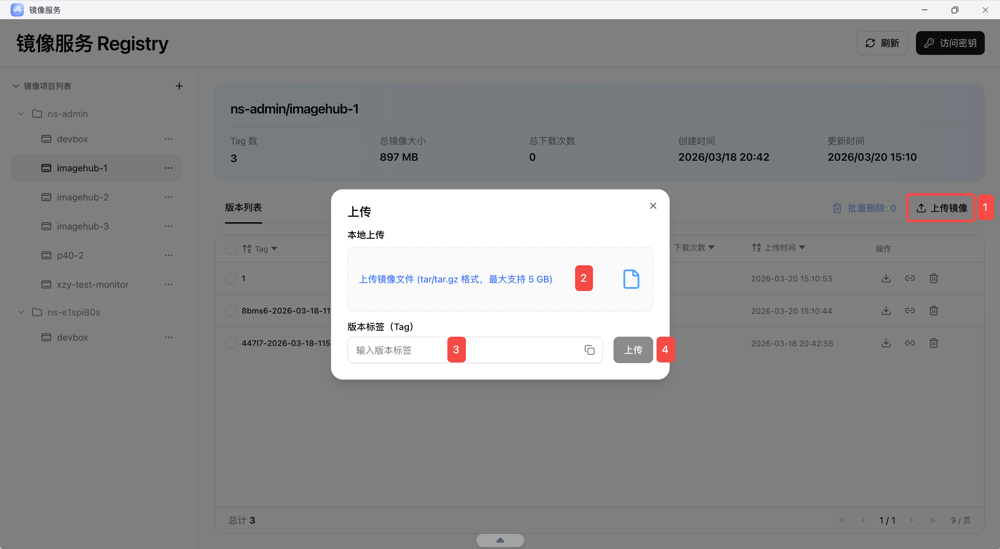
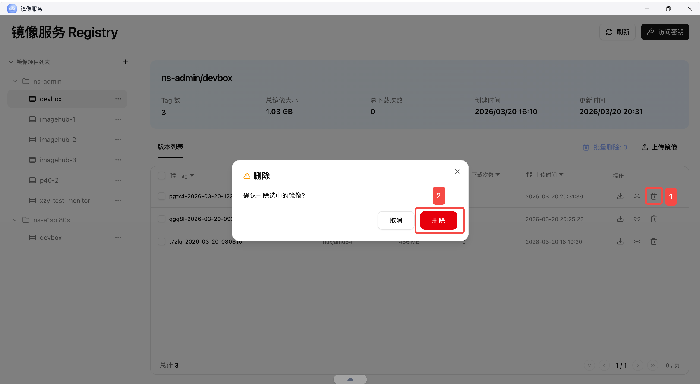

## 应用说明

镜像服务应用会记录当前空间内的所有的镜像更迭，方便空间所有者统一查看和管理镜像项目、访问密钥与版本内容。

- 命名通常使用工作空间 ID，例如 `ns-xxxx`




## 创建分类

### 1. 新增项目

- 命名空间：项目的一级目录，一般为工作空间 ID，例如 `ns-xxxx`，默认为 `ns-admin`
- 名称：通常填写应用名称
- 描述：用于补充项目用途、来源或交付说明




### 2. Registry 配置

进入访问密钥后，可以直接获取本地登录 Registry 所需的配置信息。




### 3.本地登录仓库

- 访问密钥以秘文形式展示
- 页面只支持点击复制按钮复制，无法直接查看明文
- 复制后即可在本地工具或 CI 流程中完成仓库登录

仓库地址格式通常为 `hub.<域名>`。

例如域名为 `192.168.10.70.nip.io`，则仓库地址为：

```text
hub.192.168.10.70.nip.io
```

下面以 `crane` 为例，说明如何直接在本地登录仓库：

```bash
crane auth login -u <用户名> -p <访问密钥> hub.192.168.10.70.nip.io
```

## 上传镜像

### 使用 Docker 推送镜像

为镜像打上目标仓库标签

```bash
docker tag test-image:1 hub.192.168.10.70.nip.io/ns-admin/test-image:1
```

推送镜像

```bash
docker push hub.192.168.10.70.nip.io/ns-admin/test-image:1
```

### 使用 Crane 推送镜像

导出本地镜像为 tar 文件

```bash
docker save test-image:1 -o test-image.tar
```

使用 crane 推送 tar 文件到仓库

```bash
crane push test-image.tar hub.192.168.10.70.nip.io/ns-admin/test-image:2
```

### 上传本地镜像

- 控制台支持上传兼容 OCI 镜像规范的 `tar` 或 `tar.gz` 包
- 上传时需要指定版本 Tag
- 如果 Tag 重复，系统会直接覆盖原有镜像版本



## 删除镜像

- 支持单镜像删除
- 支持批量删除
- 删除前建议确认该镜像标签未被正在运行的应用或交付流程引用

