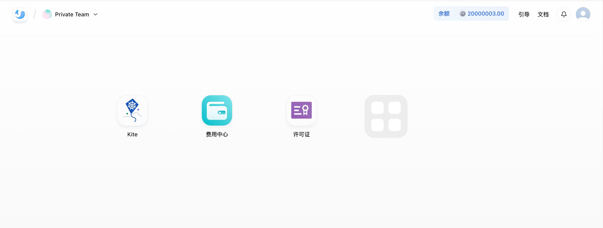
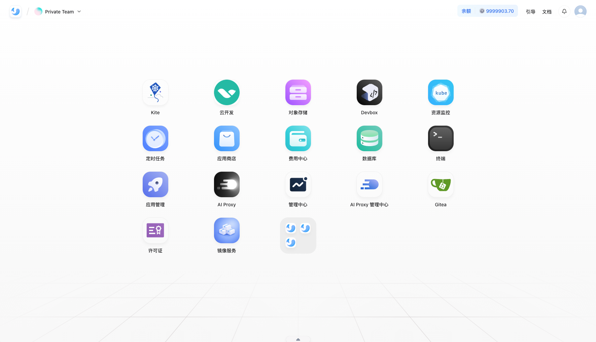

说明如何在企业自有环境中部署、激活、运维和治理 Sealos。它是公有云主线文档之外的扩展专区，主要服务于交付、管理员和运维角色。


## 开源版部署

支持一条命令安装 Sealos，仅包含基础底座及 Kite 应用，适合5台机器以下测试集群使用。

```ts
curl https://objectstorageapi.hzh.sealos.run/paxilf30-static/oss-install.sh | bash -s --

```




## 商业版

商业版单集群最大支持 128台物理机（虚拟机数量不限），更适合下面这些典型企业场景：

- 内网、专有云或监管环境的私有化部署
- 需要统一纳管多个团队、多个空间、多个集群
- 需要在企业内部提供标准化应用、高可用服务、开发和 AI 基础设施能力

### 部署教程

- [商业版部署教程](/docs/private-cloud/deployment)




相对开源版，商业版在现有功能清单里重点补齐了以下能力：

- 账号体系：支持不限账号、第三方登录和单点登录
- 团队治理：支持空间、权限、配额和资源边界控制
- 产品能力：支持应用管理、DevBox、laf、FastGPT、数据库、对象存储、应用商店、AI Proxy、Brain、定时任务
- 平台能力：支持镜像仓库、日志、监控、告警、管理后台
- 基础设施能力：支持不限集群、纯离线部署、DNS、NTP、GPU 虚拟化


